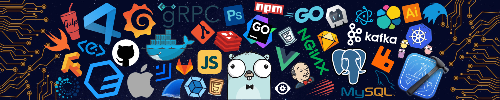

<h1 align="center">

</h1>

<h1 align="center"></h1>

  <h1 align="center">𝓗𝓲 , 𝓘'𝓶 𝓥𝓲𝓹𝓾𝓵</h1>
<h3 align="center">🎀 𝒜 𝒫𝓇💞𝑔𝓇𝒶𝓂𝓂𝑒𝓇 🎀🧑‍💻</h3>

## 🙋‍♂️ About Me

- 🎓 𝐈 𝐚𝐦 𝐜𝐮𝐫𝐫𝐞𝐧𝐭𝐥𝐲 𝐩𝐮𝐫𝐬𝐮𝐢𝐧𝐠 𝐦𝐲 **𝐁𝐚𝐜𝐡𝐞𝐥𝐨𝐫'𝐬 𝐢𝐧 𝐂𝐨𝐦𝐩𝐮𝐭𝐞𝐫 𝐄𝐧𝐠𝐢𝐧𝐞𝐞𝐫𝐢𝐧𝐠**

- 🌱 I’m currently learning **Data Structures and Algorithms**

- 👯 𝐈’𝐦 𝐜𝐮𝐫𝐫𝐞𝐧𝐭𝐥𝐲 𝐥𝐞𝐚𝐫𝐧𝐢𝐧𝐠 **𝐃𝐚𝐭𝐚 𝐒𝐭𝐫𝐮𝐜𝐭𝐮𝐫𝐞𝐬 𝐚𝐧𝐝 𝐀𝐥𝐠𝐨𝐫𝐢𝐭𝐡𝐦𝐬**

- 👨‍💻 𝐀𝐥𝐥 𝐨𝐟 𝐦𝐲 𝐩𝐫𝐨𝐣𝐞𝐜𝐭𝐬 𝐚𝐫𝐞 𝐚𝐯𝐚𝐢𝐥𝐚𝐛𝐥𝐞 𝐚𝐭 **[𝐌𝐲 𝐏𝐨𝐫𝐭𝐟𝐨𝐥𝐢𝐨](https://vipul1432.github.io/Vipul-Portfolio/)**

- 📫 𝐇𝐨𝐰 𝐭𝐨 𝐫𝐞𝐚𝐜𝐡 𝐦𝐞 **[𝐯𝐢𝐩𝐮𝐥𝐮𝐩𝐚𝐝𝐡𝐲𝐚𝐲𝟓𝟔𝟑@𝐠𝐦𝐚𝐢𝐥.𝐜𝐨𝐦](mailto:vipulupadhyay563@gmail.com)**
  
  

## 👨🏻‍💻 Coding Profiles

## ⚡ Technologies

### Language

### Libraries & Framework

<!--  -->
<!--  -->

### Tools:

<!--  -->

<!-- 

 -->
<!--  -->

## 📈 Stats

<table>
<tr>
<td>

<td>
</td>
</tr>
</table>

 

 

<a href="https://github.com/Vipul1432">

</a> 

	

 
## ❤️ Views and Followers
 

  

<h2 align="center">❤️ Support</h2>

🎀 Contributions (<a href="https://guides.github.com/introduction/flow" title="GitHub flow">GitHub Flow</a>), 🔥 issues, and 🥮 feature requests are most welcome!

💙 If you like my projects, Give them ⭐ and Share it with friends!

Made with ❤️ in India
  

<h1 align='center'>⚡️<i>Stay awesome!</i>⚡️</h1>

 
