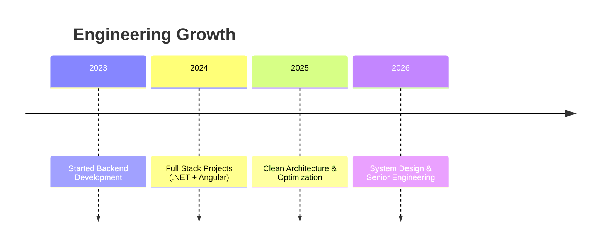

<!-- ========================================================= -->
<!--                EXTREME PRO GITHUB PROFILE                 -->
<!--        Ultra Modern • FAANG Style • Senior Engineer       -->
<!-- ========================================================= -->

<!-- ================= HERO HEADER ================= -->

<div align="center">


# 👋 Hello World, I'm Vipul

### ⚡ Full Stack Engineer | .NET Specialist | Angular Developer | Performance Optimizer


</div>

---

<!-- ================= CYBER VISUAL ================= -->

<p align="center">

</p>

---

# 🧠 Engineering Identity

```diff
+ Full Stack Engineer (.NET + Angular)
+ Backend Architecture Specialist
+ Performance Optimization Focus
+ Clean Code & Scalable Systems
+ Real-world production mindset
```

I build systems that are:

✅ Maintainable  
✅ Scalable  
✅ High Performance  
✅ Production Ready  

---

# ⚡ Core Engineering Stack

## 💻 Languages


---

## ⚙️ Frameworks


---

## 🗄️ Database & Infra


---

# 📊 Engineering Analytics Dashboard

<p align="center">


</p>

---

# 🔥 Contribution Activity Graph

<p align="center">

</p>

---

# 📈 GitHub Streak

<p align="center">
<a href="https://git.io/streak-stats"></a>
</p>


---

# 🧩 Competitive Coding Profiles

[](https://leetcode.com/)
[](https://www.hackerrank.com/vipulupadhyay563)

---

# 🧠 Engineering Philosophy

```javascript
function engineer() {
  while(true){
     learn();
     build();
     optimize();
     scale();
  }
}
```

---

# 🛣️ Career Roadmap



---

# 🌐 Connect With Me

[](mailto:vipulupadhyay563@gmail.com)
[](http://linkedin.com/in/vipul-kumar-194ba5171/)
[](https://twitter.com/Vipul1432)
[](https://t.me/Vipulupadhyay563)

---

# 👁️ Visitors & Followers

<p align="center">


</p>

---

# 🐍 Contribution Snake

<p align="center">

</p>

---

<div align="center">

## ⚡ Stay Awesome — Keep Building 🚀

</div>


